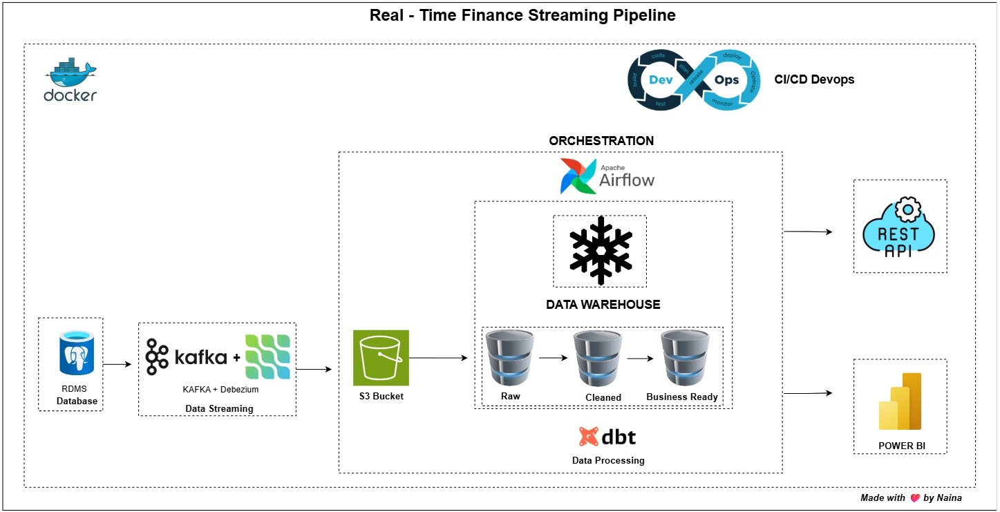

# 🏦 Financial Data Orchestration Platform – Real-Time CDC & Analytics
End-to-End Banking Data Platform with Real-Time CDC & FastAPI Backend
---

## 📌 Project Overview

**Financial Data Orchestration Platform** is a **production-grade banking data platform** that combines a **modern data stack** with a
**high-performance FastAPI backend**.

It simulates real-world banking systems by generating OLTP data, capturing **real-time Change Data Capture (CDC)**,
transforming data into analytics-ready models, and exposing **secure, scalable REST APIs** for both operational and
analytical use cases.

This project demonstrates hands-on expertise in:

- Data Engineering  
- Backend API Development  
- Streaming & CDC  
- Cloud Data Warehousing  
- CI/CD & Containerization  
- Production-style system architecture  

---

## 🧠 Key Engineering Highlights

- Designed and implemented a **real-time CDC pipeline** using **Kafka + Debezium**
- Built **Bronze–Silver–Gold** data layers in **Snowflake**
- Implemented **Slowly Changing Dimensions (SCD Type-2)** using **DBT snapshots**
- Orchestrated ingestion and transformations with **Apache Airflow**
- Developed **FastAPI-based CRUD APIs** serving live data from Snowflake
- Containerized the entire platform using **Docker & docker-compose**
- Automated testing and deployment using **GitHub Actions (CI/CD)**

---

## 🏗️ System Architecture

### High-Level Flow

1. **PostgreSQL (OLTP)**  
   Simulated banking source system (customers, accounts, transactions)

2. **Kafka + Debezium**  
   Captures WAL changes and streams CDC events

3. **MinIO (S3-compatible storage)**  
   Stores raw CDC data as immutable event logs

4. **Apache Airflow**  
   Orchestrates ingestion, snapshots, and transformations

5. **Snowflake Data Warehouse**  
   Stores raw, transformed, and historical data

6. **DBT**  
   Transforms data, builds marts, and manages SCD Type-2 snapshots

7. **FastAPI Backend**  
   Exposes RESTful APIs for real-time data access and manipulation

8. **GitHub Actions**  
   CI/CD pipelines for testing, validation, and deployment

---
## ⚡ Tech Stack

### Data & Streaming
- PostgreSQL  
- Apache Kafka  
- Debezium  
- MinIO (S3-compatible)

### Orchestration & Transformation
- Apache Airflow  
- DBT  

### Warehouse
- Snowflake  

### Backend
- FastAPI  
- Python  

### DevOps
- Docker & docker-compose  
- GitHub Actions  
- Git  

---

## ✅ Core Features

- End-to-end banking data pipeline from **OLTP to analytics**
- **Real-time CDC** using Kafka & Debezium
- Incremental and snapshot-based ingestion
- Historical tracking using **DBT SCD Type-2 snapshots**
- Modular, scalable **FastAPI REST services**
- Fully containerized local development environment
- CI/CD automation for data and API layers

---

## 📂 Repository Structure

```text
fin-data-orchestration-platform/
├── apis/                      # FastAPI routers for customers, accounts, transactions
│   ├── __init__.py
│   ├── customers.py           # Customer CRUD API
│   ├── accounts.py            # Account CRUD API
│   └── transactions.py        # Transaction CRUD API
├── core/
│   ├── __init__.py
│   └── db.py                  # Snowflake connection helper
├── banking_dbt/               # DBT project (models, snapshots, tests)
├── consumer/                  # Kafka to MinIO ingestion script
├── data-generator/            # Faker-based synthetic data generator
├── docker/                    # Airflow DAGs, plugins, and configs
├── kafka-debezium/            # Kafka connectors and CDC config
├── postgres/                  # PostgreSQL OLTP schema and seeds
├── docker-compose.yml         # Container orchestration
├── requirements.txt           # Python dependencies
├── main.py                    # FastAPI app entrypoint
├── README.md                  # This file
└── .github/workflows/         # CI/CD GitHub Actions workflows
```

---

## 🌐 REST API Endpoints

| Operation                   | HTTP Method | URL                              | Description                               |
|-----------------------------|-------------|----------------------------------|-------------------------------------------|
| **Customers**               |             |                                  |                                           |
| List all current customers  | GET         | `/customers`                     | Retrieve all current customers            |
| Get customer by ID          | GET         | `/customers/{customer_id}`       | Retrieve a single current customer by ID  |
| Create a new customer       | POST        | `/customers`                     | Add a new customer record                 |
| Update existing customer    | PUT         | `/customers/{customer_id}`       | Update details of an existing customer    |
| Delete a customer           | DELETE      | `/customers/{customer_id}`       | Delete a customer record                  |
|                             |             |                                  |                                           |
| **Accounts**                |             |                                  |                                           |
| List all current accounts   | GET         | `/accounts`                      | Retrieve all current accounts             |
| Get account by ID           | GET         | `/accounts/{account_id}`         | Retrieve a single current account by ID   |
| Create a new account        | POST        | `/accounts`                      | Add a new account record                  |
| Update existing account     | PUT         | `/accounts/{account_id}`         | Update details of an existing account     |
| Soft delete an account      | DELETE      | `/accounts/{account_id}`         | Mark an account as inactive (soft delete) |
|                             |             |                                  |                                           |
| **Transactions**            |             |                                  |                                           |
| List all transactions       | GET         | `/transactions`                  | Retrieve all transactions                 |
| Get transaction by ID       | GET         | `/transactions/{transaction_id}` | Retrieve a single transaction by ID       |
| Create a new transaction    | POST        | `/transactions`                  | Add a new transaction record              |
| Update existing transaction | PUT         | `/transactions/{transaction_id}` | Update details of an existing transaction |
| Delete a transaction        | DELETE      | `/transactions/{transaction_id}` | Delete a transaction record               |

---

## ⚙️ Step-by-Step Implementation

### 1. Data Simulation

- Generated synthetic banking data (**customers, accounts, transactions**) using **Faker**.
- Inserted data into **PostgreSQL (OLTP)** so the system behaves like a real transactional database (**ACID, constraints
  **).
- Controlled generation via `config.yaml`.

---

### 2. Kafka + Debezium CDC

- Set up **Kafka Connect & Debezium** to capture changes from **Postgres**.
- Streamed **CDC events** into **MinIO**.

---

### 3. Airflow Orchestration

- Built DAGs to:
    - Ingest **MinIO data → Snowflake (Bronze)**.
    - Schedule **snapshots & incremental loads**.

---

### 4. Snowflake Warehouse

- Organized into **Bronze → Silver → Gold layers**.
- Created **staging schemas** for ingestion.

---

### 5. DBT Transformations

- **Staging models** → cleaned source data.
- **Dimension & fact models** → built marts.
- **Snapshots** → tracked history of accounts & customers.

---

### 6. FastAPI Backend

- Modular FastAPI project exposes **CRUD REST APIs** for customers, accounts, and transactions.
- Connects directly to Snowflake to serve and manipulate data.
- Supports real-time data access beyond batch pipelines.
- Includes data validation, error handling, and timestamp management.

---

### 7. CI/CD with GitHub Actions

- **ci.yml:** Runs linting, DBT compile, and tests on pull requests.
- **cd.yml:** Deploys Airflow DAGs and DBT models on merge to main branch.
- FastAPI deployment can be integrated similarly.

---

## 🚀 Getting Started

1. Clone the repo:
   ```bash
   git clone https://github.com/<your-username>/fin-data-orchestration-platform.git
   cd fin-data-orchestration-platform
   ```

2. Configure environment variables for Snowflake credentials and other secrets.

3. Build and start containers:
   ```bash
   docker-compose up --build
   ```

4. Access FastAPI docs at:
   ```
   http://127.0.0.1:8000/docs
   ```

5. Run DBT models and Airflow DAGs as per instructions in respective folders.

## 📈 Usage

- Use FastAPI endpoints to **fetch, create, update, and delete** customers, accounts, and transactions.
- Monitor data lineage and history with DBT snapshots and Airflow orchestration.
- Extend or integrate with frontend apps, BI tools, or other services.

---

## 📊 Final Deliverables

- **Automated CDC pipeline** from Postgres → Snowflake, ensuring real-time data ingestion and consistency.
- **DBT models** including facts, dimensions, and snapshots implementing Slowly Changing Dimensions (SCD Type-2) for
  historical tracking.
- **Orchestrated DAGs in Apache Airflow** managing ingestion, transformation, and snapshot workflows with scheduling and
  monitoring.
- **Synthetic banking dataset** generated with Faker, simulating realistic customers, accounts, and transactions for
  testing and demos.
- **Robust FastAPI backend** exposing fully functional CRUD REST APIs for customers, accounts, and transactions,
  enabling real-time data access and manipulation beyond batch processing.
- **Comprehensive CI/CD workflows** using GitHub Actions automating linting, testing, building, and deployment of both
  data pipelines and API services, ensuring continuous reliability and delivery.


---

## 👤 Author
**Naina Sharma**  
Software Engineer

[LinkedIn: naina-sharma](https://www.linkedin.com/in/naina-sharma-67318a220)

---
